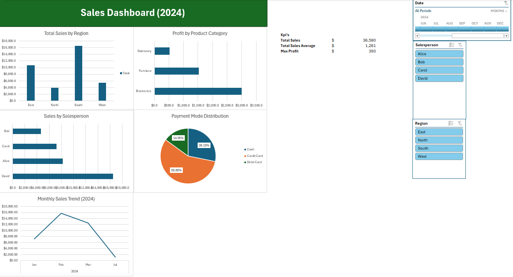

# excel-sales-dashboard
Built an Excel dashboard to analyze sales performance and key business metrics.
## 📊 Dashboard Preview  

## 🧠 Key Insights  
- South region generated the highest sales, significantly outperforming others  
- Sales show variability across months, with a noticeable peak early in the year  
- Electronics category drives the highest profit  
- Credit card is the dominant payment method  
- Top-performing salesperson significantly outperforms peers
- ## 🛠 Tools Used  
- Microsoft Excel  
- Pivot Tables  
- Charts  
- Data cleaning and structuring
- ## 💡 Design Approach  
Focused on clarity and usability by organizing the dashboard to highlight key metrics, reduce cognitive load, and support quick decision-making.
